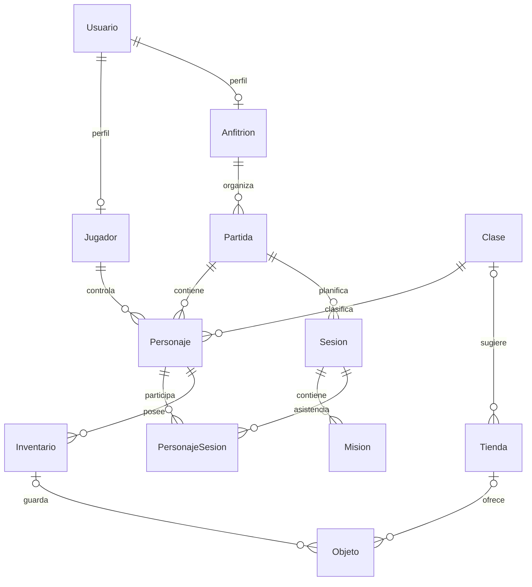

# Modelo de datos implementado

Fuente: las doce entidades en [src/entities](../src/entities). Este documento describe el código integrado con el PR #31, no una propuesta de rediseño. El [DER anterior](DER_NEW.png) permanece como referencia histórica.

## Relaciones

Las cardinalidades muestran referencias del modelo persistente; las reglas de creación y de negocio pueden exigir condiciones adicionales. Por ejemplo, crear un personaje genera su primer inventario en una transacción.

## Claves y datos

| Entidad | Clave primaria | Atributos y referencias principales |
| --- | --- | --- |
| Usuario | idUsuario | nombreUsuario, nickname único, contrasena, imagen |
| Jugador | idUsuario (FK Usuario) | estado |
| Anfitrion | idUsuario (FK Usuario) | karma, cantPartidasActuales |
| Clase | idClase | nombreClase, descripcionClase |
| Partida | idPartida | nombre, estado, limiteJugadores, contrasena, idUsuarioAnfitrion |
| Personaje | idPersonaje | nombreFicticio, raza, xp, nivel, dinero, idClase, idUsuarioJugador, idPartida |
| Sesion | idPartida + numSesion | duracionSesion, cantJugadores, estadoSesion |
| Mision | idPartida + numSesion + numMision | descripcion, dineroTotal, xpTotal, xpOtorgadoJugadores, dineroOtorgadoAJugadores, asistenciaGrupoGrande, estado |
| Inventario | idPersonaje + numInventario | cantidadEspacio |
| Objeto | idObjeto | nombre, descripcion, valor, nivelObjeto, tipoObjeto, esUnico, posicion; tienda e inventario opcionales |
| Tienda | idTienda | nombre, claseTienda, idClase opcional |
| PersonajeSesion | idPersonaje + idPartida + numSesion | dioKarma |

## Aclaraciones para la defensa

- Una cuenta puede tener perfil jugador, anfitrión o ambos; no son especializaciones disjuntas.
- Un personaje puede tener varios inventarios. Sus números se repiten entre personajes distintos.
- Sesiones y misiones se numeran dentro de su padre; sus identificadores aislados no son globalmente únicos.
- `PersonajeSesion` conserva asistencia y si el participante ya calificó al anfitrión.
- `esUnico` se almacena desde el PR #31. Las bases anteriores requieren el [cambio incremental](instalacion.md#bases-existentes-campo-de-objeto-único).
- Las contraseñas almacenadas son hashes, no valores que la API deba devolver. La privacidad de la partida se expresa en el DTO sin exponer el hash.
- El estado de partida se almacena como booleano y se presenta como activa/finalizada. Sesión usa 0 (planificada), 1 (en curso), 2 (finalizada); misión usa pendiente/completada.
- No confundir las entidades con los DTO: estos incluyen nombres relacionados, indicadores calculados y referencias aplanadas. Ver [reglas y endpoints](funcionalidad.md).

Este modelo no implica que todas las restricciones estén declaradas como índices de MySQL. Varias se aplican en servicios y transacciones; deben verificarse mediante pruebas de integración.
